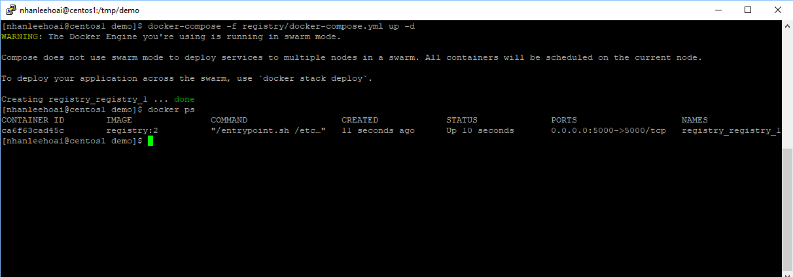
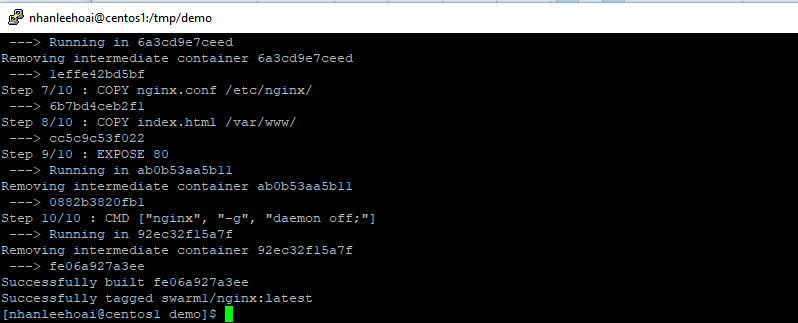
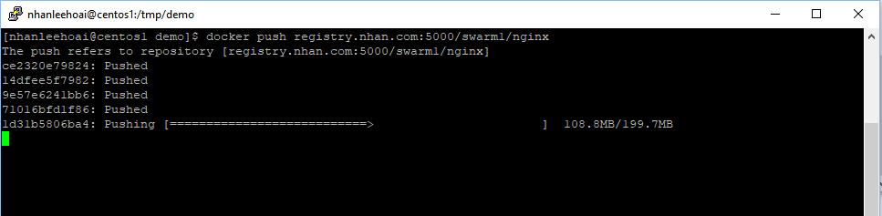
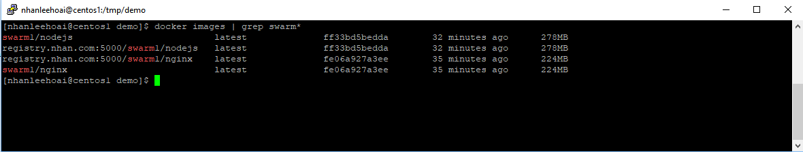
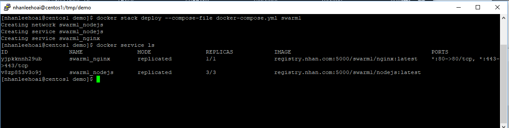
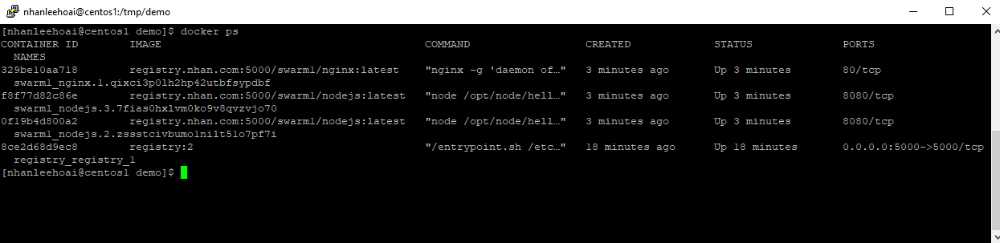
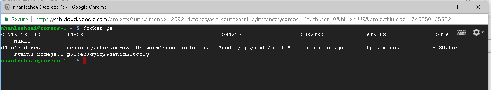
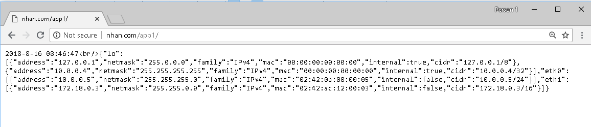
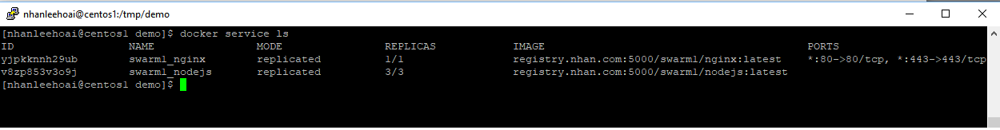
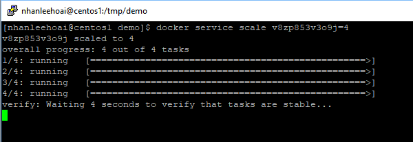

# Demo of Docker Swarm, Registry, Nginx, Nodejs

This is a demo that we can user Docker Swarm to scale up the application with ease provided that 
the applications are designed with Microservice architecture in mind.

### Prerequisite

- Basick knowledge of Docker and Docker Compose, Docker Registry
- Two linux servers installed with Docker CE 18.x and latest Docker Compose.
- One of the server is the Docker Manager and the other is a worker nodes

In my case, I have :
  - A CentOS 7 server name centos1. It plays the role of Docker Manager 
  - A CoreOS server which joined the Swarm as a worker node
  

Let check out the reposity and copy to the temporary folder on the docker manager server

###Prepare and run a local Registry

When we deploy services by docker swarm, the Manager automitcally schule a task to run on all active nodes
(Of course we can init and run Docker Swarm in only ONE node for research purpose, however, in production evironment, there must be multiple nodes otherwise the application is not really scale )

When the Manager tells the Worker node to run a new image instance, of course the Worker node must know where to pull the image. That's why we need a have a Registry that all nodes must have access to

Look into the "registry" sub-folder, you see the "docker-compose.yml" there. This is used to run the registry
In order to secure the registry communication, we must enable the TLS. 


We must name the registry and use it in all nodes. In my case, I name it "registry.nhan.com"

```
sudo echo "10.x.x.x registry.nhan.com" >> /etc/hosts
```

- Generate a self-signed SSL certificate, run this on Manager server
```
openssl req -newkey rsa:4096 -nodes -keyout registry.key -x509 -days 365 -out registry.cert
```

+ The generated  file "registry.key" is private key
+ "registry.cert" is the public key and it can be used as CA cert.

Because this is self -signed certificate, it is not trusted by default. 

To tell Docer to trust any certiciate signed by this CA, we must copy the CA cert to the folder "/etc/docker/certs.d/<your registry uri>"

Do this on this Manager server, then repeat for all Worker nodes (we can use WinsCP to copy this CA cert to Worker Nodes)

IMPORTANT NOTE: as convention, the CA file extension must be .crt

```
sudo mkdir -p /etc/docker/certs.d/registry.nhan.com:5000
sudo cp registry.cert /etc/docker/certs.d/registry.nhan.com:5000/ca.crt
	
```

Now copy the private key and cert to a folder which is used by the registry
Run this a the user that can run docer and docker-compose and on the Manager node only

```
mkdir -p /opt/registry
mv registry.cert /opt/registry/registry.cert
mv registry.key /opt/registry/registry.key	
```

That's it. Now the registry is ready to run

Run this on the Swarm Manager node.

```
	docker-compose -f registry/docker-compose.yml up  -d

```

Check to ensure the registry sucessfully run

```
	docker ps
```




### Build the images

- 1. Buid Nginx image

```
	docker build --force-rm -t swarm1/nginx nginx/
```



- 2. Buid Nodejs image

```
	docker build --force-rm -t swarm1/nodejs nodejs/

```

The two images built above are store on local. Now, in order that all nodes in the Swarm can download, we must push them to the Registry


```	
	docker tag swarm1/nginx registry.nhan.com:5000/swarm1/nginx
	docker push registry.nhan.com:5000/swarm1/nginx
```



Do same for the Nodejs image

```	
	docker tag swarm1/nodejs registry.nhan.com:5000/swarm1/nodejs
	docker push registry.nhan.com:5000/swarm1/nodejs
```

Check the images

```
	docker images | grep swarm*
```


### Run and scale the applicaton

Now it's time to rock and roll. Let's deploy the stack 

```
	docker stack deploy --compose-file docker-compose.yml swarm1
	
```
Run this on Manager node. 

```
	docker service ls
	
```


It take few minutes for the service to fully run. Be patient!
Check the running container on Manager node

```
	docker ps
```
Here is the result


Do same on the worker


Let's explain: 
+ On the Manager node, we can see
	- One container for registry
	- One container for Nginx 
	- Two containers for nodejs 

+ On the Worker node, we can see only one instance of Nodejs

- Now, check the result on browser http://nhan.com/app1/ (note that nhan.com is the public IP of the Manager node)



If we refresh the browser (F5), we'll see the IP of the Nodejs server changes. That means the request is served from a diffrent NodeJs instance!!!

-Now scale it up!!!  

```
	docker service ls
```



Now we now the ID of Nodejs service. let have 4 instance of NodeJs

```
	docker service scale <node serviceid>=4
```



Now guess the new instance of Nodejs run on which server?? It is Worker server! because Swarm evenly balance the instance


OK what's next?  Let drain the WORKER  to see what's happen

```
	docker node ls
```


```
	docker node update --availability drain <workder-node-id>
```

Check the container on Manager node we'll see Swarm has run addtionally 2 Nodejs instance due to the fact WORKER is down

```
	docker ps
```


